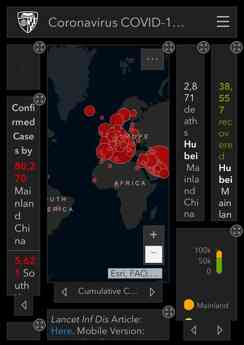
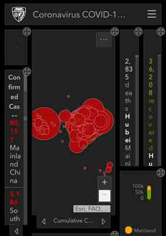

# First Paint and First Contentful Paint
As implementation begins for First Contentful Paint (FCP) in WebKit, the question came up over whether First Paint and First Contentful Paint are really all that different, and whether the paint timing API should include First Paint at all.

I looked at several sites loading on different browsers on [WebPageTest](https://webpagetest.org/) to understand this better. Here are some examples I found illustrative. Each browser name links to the WebPageTest run with full filmstrips.

[Coronavirus COVID-19 Global Cases by Johns Hopkins CSSE](https://gisanddata.maps.arcgis.com/apps/opsdashboard/index.html#/bda7594740fd40299423467b48e9ecf6)

This site shows divs with animating background colors and sizes as a loading bar. After several seconds of loading, it shows the text "Loading..." under the bar, and after several seconds more it fully loads the content. WebKit's paint strategy is to wait to paint until the text is displayed; Chrome and Firefox display the loading bars immediately.

| Browser | First Paint | First Contentful Paint | Fully Loaded |
| ------- | ----------- | ---------------------- | ------------ |
| [Firefox](https://webpagetest.org/video/compare.php?tests=200304_BN_8fb0fe6f852598cc30ff2b05ed5a22d9-r:1-c:0) |  |  | 
| [Chrome](https://webpagetest.org/video/compare.php?tests=200303_XW_1f8d5fa19588c719ae35f461edf479cb-r:1-c:0) |  |  | 
| [Safari](https://webpagetest.org/video/compare.php?tests=200303_MM_0b34f8c18da60496d352db2492356676-r:1-c:0) |  |  | 

[Bing](https://www.bing.com)

The Bing site has a searchbox, a logo, and a background image. Firefox and Chrome render the search box first, while WebKit paints after the image and background gradient CSS are loaded.

There is an open issue to [consider taking form controls into account for first contentful paint](https://github.com/w3c/paint-timing/issues/52), which would change the First Contentful Paint timings for Bing in Gecko and Blink.

| Browser | First Paint | First Contentful Paint | Additional Paint | Fully Loaded |
| ------- | ----------- | ---------------------- | ---------------- | ------------ |
| [Firefox](https://webpagetest.org/video/compare.php?tests=200304_N8_9e8622e847c7c64d6680e799b3d2ec89-r:1-c:0) |  |  | 
| [Chrome](https://webpagetest.org/video/compare.php?tests=200304_TB_20acead7a8ddbb8dae82728dcfcb639a-r:3-c:0) |  |  | 
| [Safari](https://webpagetest.org/video/compare.php?tests=200304_Q4_2739057c4482239d2888364f9545338c-r:1-c:0) |  |  | 

[Youtube](https://m.youtube.com)

Youtube puts up placeholder images before the main content displays. WebKit's paint strategy is to wait until some additional content (in this case the text captions of the videos) is loaded before painting. Chrome and Firefox paint the placeholder divs with no content.

| Browser | First Paint | First Contentful Paint | Fully Loaded |
| ------- | ----------- | ---------------------- | ------------ |
| [Firefox](https://webpagetest.org/video/compare.php?tests=200304_RE_873b0b6b175af4dfef7c95f2afe19903-r:1-c:0) |  |  | 
| [Chrome](https://www.webpagetest.org/video/compare.php?tests=200303_HC_d1bf1bc0f4c39a0c23c728ac35dae40d-r:1-c:0) |  |  | 
| [Safari](https://webpagetest.org/video/compare.php?tests=200303_WA_2eaa85a6ef7972dd2d49b26fb668a68d-r:1-c:0) |  |  | 

[Turbotax](https://myturbotax.intuit.com)

Turbotax has a loading spinner with no text or images. Safari does not show the spinner; Chrome and Firefox do.

| Browser | First Paint | First Contentful Paint | Additional Paint | Fully Loaded |
| ------- | ----------- | ---------------------- | ---------------- | ------------ |
| [Firefox](https://webpagetest.org/video/compare.php?tests=200304_ZM_736347ffc03de991c029189f5404affc-r:1-c:0) |  |  | 
| [Chrome](https://webpagetest.org/video/compare.php?tests=200304_6S_2e7a067b9116ca73f2400204853a4d5b-r:1-c:0) |  |  | 
| [Safari](https://webpagetest.org/video/compare.php?tests=200304_XC_a1c22eda813311006493df274515f76b-r:1-c:0) |  |  | 
